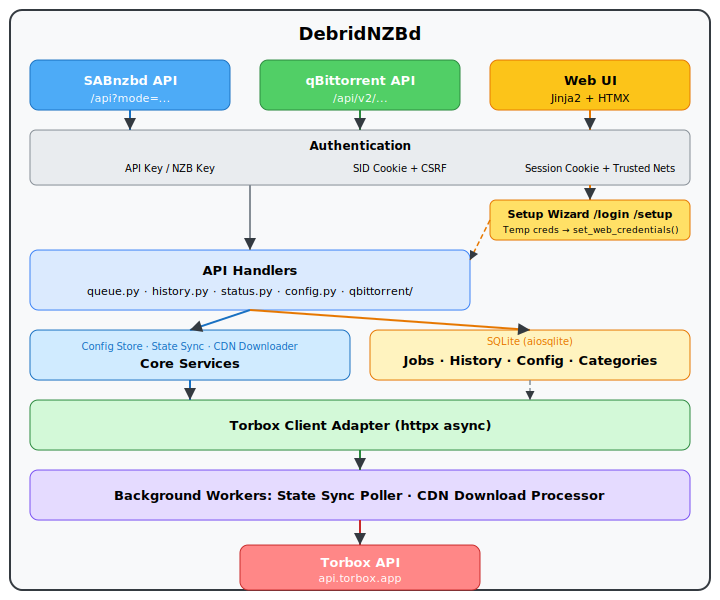
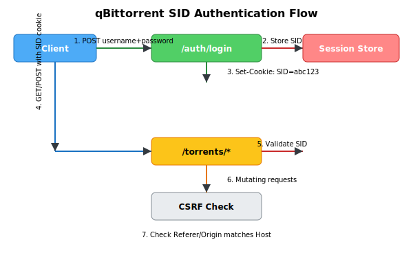
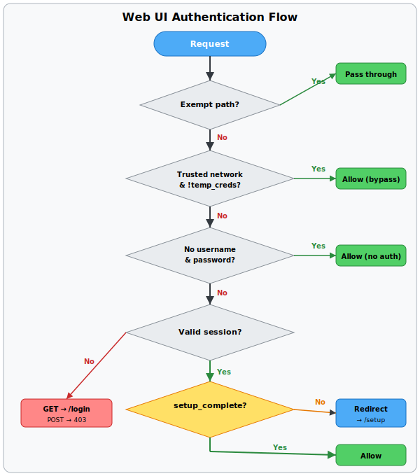

# DebridNZBd Architecture Documentation

## Overview

DebridNZBd is a web service that implements two download management APIs:

1. **SABnzbd HTTP API** (`/api?mode=...`) — for *arr client integration (Sonarr, Radarr, Lidarr, Readarr, etc.)
2. **qBittorrent WebUI API** (`/api/v2/...`) — for torrent management client integration (Transdroid, qBittorrent Remote, etc.)

Both APIs route all download requests through the Torbox debrid service, providing a unified
gateway that works with existing client applications without modification.

## System Architecture



## Request Flows

### Adding a Download (SABnzbd API)

1. Client sends `GET /api?mode=addurl&name=<URL>&apikey=<KEY>`
2. `api/auth.py` validates the API key against config
3. `api/router.py` dispatches to `api/queue.py:handle_addurl()`
4. `api/queue.py:detect_url_type()` detects the URL type:
   - `.nzb` extension → usenet
   - `magnet:?` prefix → torrent
   - Other URL → webdl (or configured default)
5. `api/queue.py` generates an nzo_id, inserts a job row in SQLite
6. `torbox/client.py` submits to the appropriate Torbox endpoint
7. Response returned in SABnzbd format: `{"status": true, "nzo_ids": ["SABnzbd_nzo_abc123"]}`

### Uploading a File (SABnzbd API)

1. Client sends `POST /api?mode=addfile` with multipart form data containing a `.torrent` or `.nzb` file
2. `api/router.py` extracts the file bytes and filename from the `UploadFile` object
3. `api/queue.py:handle_addfile()` detects type from the file extension:
   - `.torrent` → torrent
   - `.nzb` → usenet
   - Falls back to configured default type
4. `torbox/client.py` submits the file bytes to the appropriate Torbox endpoint
5. Creates a local job in the queue and returns the nzo_id

### Adding a Download (qBittorrent API)

1. Client sends `POST /api/v2/torrents/add` with SID cookie authentication
2. `api/qbittorrent/auth.py` validates the SID cookie
3. `api/qbittorrent/dependencies.py` checks CSRF (Referer/Origin matches Host)
4. `api/qbittorrent/torrents.py` handles the request:
   - `urls` parameter: magnet links or HTTP URLs (newline-separated)
   - `torrents` parameter: uploaded .torrent files (multipart)
   - `paused` parameter: if `true`, job status set to Paused locally
5. `torbox/client.py` creates the download via Torbox
6. Creates a local job with `torbox_hash` populated for hash-based lookups
7. Returns plain text `Ok.`

### State Synchronization

1. `core/state_sync.py` runs every N seconds (configurable, default 5)
2. Calls `torbox/client.py` to fetch usenet/torrents/webdl lists
3. Matches Torbox IDs to local jobs by `torbox_id` column
4. Updates job status, size, percentage, speed from Torbox data
5. **Computes download speed** from `sizeleft` delta between poll cycles
6. **Detects stalled downloads** — if `percentage` is unchanged for 60+ seconds while status is "Downloading" or "Fetching", the download is considered stalled
7. **Skips locally-paused jobs** — jobs with status `Paused` are not overwritten by the poller
8. If a job reaches "completed" or "cached" state:
   - Requests CDN download link via `torbox/client.py:request_*_dl()`
   - Enqueues the job to the CDN download worker pool (`run_cdn_processor`)
9. `core/cdn_downloader.py` streams the CDN file to local disk
10. On success: marks job as `Complete`, inserts into `history` table immediately (for *arr visibility), and keeps it in the `jobs` table during the grace period

#### File Permissions

Downloaded files are set to `0o666` (world read/write) after each successful CDN download or file move. This ensures *arr clients and other services can access the file regardless of the process umask. The chmod is applied at every point where a file reaches its final resting place:

1. After atomic rename from temp file (async and sync download paths)
2. After cross-filesystem copy fallback
3. After `shutil.move()` to the category directory
4. When the file already exists at the destination (dedup path)

If `chmod` fails (e.g., on restricted filesystems like NFS or SMB/CIFS), the error is logged at debug level and the download proceeds normally.
11. **Orphaned jobs** (deleted on Torbox side) are reconciled by matching URL, magnet hash, filename, or type

**Note on Torbox API response format:** When querying by specific ID (e.g., `get_torrent_list(torrent_id=123)`), the Torbox API returns `data` as a single object dict instead of a list. All `get_*_list` methods handle both formats transparently.

### Stalled Download Retry

When a download stalls (no progress for 60+ seconds), the state sync poller automatically attempts recovery:

1. **First retry** — Checks if the download is available on CDN (completed/cached/seeding on Torbox). If CDN-available, transitions the job to Fetching so the CDN processor re-downloads. If not CDN-available, sends Reannounce (torrents) or Resume (usenet) to Torbox. WebDL skips directly to step 2.
2. **Second retry** — Deletes the download from Torbox and re-submits the original URL, creating a new job.
3. **Give up** — After the third stall, marks the job as Failed.

Each retry resets the 60-second stall timer. The `retry_stalled` API mode (`?mode=retry_stalled&nzo_id=XXX`) provides manual CDN-aware retry: it checks Torbox availability by ID, corrects the job type if needed, and takes the best recovery action. The web UI shows a Retry button (↻) for stalled downloads with the stall duration displayed.

### Queue Complete Grace Period

When a download completes or fails, the job is inserted into the `history` table immediately (so *arr clients can find it in history with the correct `Storage` path), and it remains in the `jobs` table for a configurable grace period. This dual presence ensures download clients can observe the completed state from both the queue and history perspectives.

**Configuration:** `switches.queue_complete` — seconds to keep completed/failed jobs in the queue (default: `300` = 5 minutes). Set to `0` for immediate removal from the queue (the history entry still exists immediately).

**How it works:**
1. When a download completes, `_complete_job()` sets `status = "Complete"` and **inserts the job into history immediately**. This ensures *arr clients can find the download path via `?mode=history` right away.
2. The job stays in the `jobs` table with `status = "Complete"` (or `"uploading"` in qBittorrent API) during the grace period, so both queue and history endpoints show the download.
3. On each poll cycle, the state sync poller checks for jobs whose `time_completed` is older than `queue_complete` seconds.
4. Expired jobs are removed from the `jobs` table by `_move_to_history()`, which also **updates** the existing history entry with any final data (e.g., updated `local_path` from the CDN download) before deleting from the queue.
5. The qBittorrent API reports `content_path` using the actual `local_path` from the database, so *arr clients can find the downloaded file even before it moves to history.

**Why this matters:**
- *arr clients (Sonarr, Radarr) read the `Storage` field from `?mode=history` to determine the output path of completed downloads. Without immediate history insertion, *arr can't find the download path during the grace period.
- qBittorrent API only queries the `jobs` table, not `history`. Without the grace period, completed torrents vanish from the qBittorrent API immediately, causing *arr clients to treat them as failed.
- SABnzbd API clients check both queue and history. The dual presence ensures the job is visible from both endpoints.

### *arr Path Resolution

*arr clients (Sonarr, Radarr) determine download paths through multiple SABnzbd API endpoints:

1. **`Storage` from `?mode=history`** — Primary source for the output path of completed downloads. This is always populated with the local file path or the resolved `complete_dir` as a fallback.
2. **`config.Misc.complete_dir` from `?mode=get_config`** — Used for category-based path resolution. DebridNZBd injects `complete_dir` and `download_dir` into the `misc` section of the config response (resolved to absolute paths) even though they're stored in the `folders` section internally.
3. **`CompleteDir` from `?mode=fullstatus`** — SABnzbd 2.0+ replacement for `DefaultRootFolder`. Always set to the resolved absolute path of `folders.complete_dir`.
4. **`DefaultRootFolder` (`my_home`) from `?mode=queue`** — Used by SABnzbd < 2.0 clients to resolve relative `complete_dir` values. Set to the resolved absolute path of `folders.complete_dir`.

### CDN Availability Check

`check_torbox_availability()` in `state_sync.py` queries the Torbox API by specific download ID to determine the current status and CDN availability of a download. It:

1. Queries all three download types (torrent, usenet, webdl) by ID, starting with the expected type
2. Handles the Torbox API quirk where ID-based queries return `data` as a single object (dict) instead of a list
3. Verifies the result ID matches the requested ID (to prevent false matches if Torbox ignores the ID filter on error paths)
4. Corrects the job's `torbox_type` if the download was found in a different type list than expected
5. Returns `(status, is_cdn_available, progress, actual_type)` for retry decision-making

### Duplicate Detection and Cache-Aware Re-Download

When a download request is received, DebridNZBd checks the history table for a matching entry before submitting to Torbox. This avoids creating duplicate downloads and leverages cached content.

**Configuration:** `switches.duplicate_detection` — `1` to enable, `0` to disable (default). When disabled, all requests proceed to Torbox without checking history.

#### Detection Logic

For **URL submissions** (`?mode=addurl`), the check happens *before* Torbox submission:
1. Normalize the URL (lowercase scheme/host, sort query params, strip trailing `/`)
2. Query `history` table for exact URL match (by type: usenet/torrent/webdl)
3. If found → check local disk, then CDN availability

For **file uploads** (`?mode=addfile` with `.torrent` files), the check happens *after* Torbox submission:
1. Torbox returns the torrent info hash from the upload response
2. Query `history` table for matching `torbox_hash` (case-insensitive)
3. If found → check local disk, then CDN availability

NZB file uploads skip duplicate detection (no reliable hash for dedup).

#### Actions

| Condition | Action | Job Created |
|---|---|---|
| File on local disk | `reuse_local` | Job with status `Complete`, `local_path` set |
| Not on disk, cached on CDN | `redownload_cdn` | Job with status `Fetching`, CDN processor re-downloads |
| Not on disk, not on CDN | `resubmit` | Normal Torbox submission proceeds |
| Not in history | `new` | Normal Torbox submission proceeds |

For `reuse_local` and `redownload_cdn` with file uploads, the duplicate Torbox download is deleted before creating the local job.

#### URL Normalization

`normalize_url()` lowercases the scheme and host, strips trailing slashes, and sorts query parameters. This ensures `?a=1&b=2` matches `?b=2&a=1`. URLs are stored in normalized form in the jobs table so that future duplicate checks match regardless of query parameter order or case differences.

### SABnzbd API Mode Dispatch

The `api/router.py` handles all incoming `?mode=XXX` requests:

| Mode | Handler Module | Auth Required |
|------|---------------|---------------|
| `version` | `api/router.py` | No |
| `auth` | `api/router.py` | No |
| `addurl` | `api/queue.py` | Yes (API or NZB key) |
| `addfile` | `api/queue.py` | Yes (API or NZB key) |
| `queue` | `api/queue.py` | Yes (API or NZB key) |
| `pause` | `api/queue.py` | Yes (API key only) |
| `resume` | `api/queue.py` | Yes (API key only) |
| `delete` | `api/queue.py` | Yes (API key only) |
| `purge` | `api/queue.py` | Yes (API key only) |
| `switch` | `api/queue.py` | Yes (API key only) |
| `change_cat` | `api/queue.py` | Yes (API key only) |
| `priority` | `api/queue.py` | Yes (API key only) |
| `speedlimit` | `api/queue.py` | Yes (API key only) |
| `retry_stalled` | `api/queue.py` | Yes (API key only) |
| `history` | `api/history.py` | Yes (API key only) |
| `retry` | `api/history.py` | Yes (API key only) |
| `retry_all` | `api/history.py` | Yes (API key only) |
| `status`/`fullstatus` | `api/status.py` | Yes (API key only) |
| `warnings` | `api/status.py` | Yes (API key only) |
| `server_stats` | `api/status.py` | Yes (API key only) |
| `get_config`/`set_config` | `api/config.py` | Yes (API key only) |
| `del_config` | `api/config.py` | Yes (API key only) |
| `get_cats` | `api/config.py` | Yes (API or NZB key) |
| `get_scripts` | `api/config.py` | Yes (API key only) |

#### Sub-Command Routing

SABnzbd uses the `name` parameter as a sub-command within `mode=queue` and `mode=history`. DebridNZBd routes these sub-commands to the appropriate handler:

| Request | Routed To | Description |
|---------|-----------|-------------|
| `?mode=queue&name=delete&value=NZO_ID` | `handle_delete` | Delete queue item(s) |
| `?mode=history&name=delete&value=NZO_ID` | `handle_delete` | Delete history item(s) |

The `value` parameter is mapped to `nzo_ids` for compatibility with the direct `?mode=delete` endpoint. This ensures *arr clients that use the sub-command pattern (Sonarr, Radarr) have their delete requests handled correctly.

#### Delete and Purge Parameters

The `delete` and `purge` modes accept a `del_files` parameter:

- **`del_files=1`**: Remove the downloaded file from disk via `Path.unlink()`. The parent directory is **not** deleted — this matches SABnzbd behavior where *arr clients clean up files after importing but expect the directory to remain.
- **`del_files=0`** (default): Only remove the database entry. The local file stays on disk.

Active (non-Complete/Failed) downloads are also canceled on Torbox when deleted. Completed downloads are kept on Torbox so the user retains access to their files.

### qBittorrent API Endpoints

The `api/qbittorrent/` package implements the qBittorrent WebUI API v2 at `/api/v2/`.
Authentication uses cookie-based SID sessions, separate from SABnzbd API keys.

| Endpoint | Module | Description |
|----------|--------|-------------|
| `POST /auth/login` | `auth.py` | Login with username/password, get SID cookie |
| `GET/POST /auth/logout` | `auth.py` | Destroy SID session |
| `GET /app/version` | `app_info.py` | Emulated qBittorrent version (4.6.3) |
| `GET /app/webapiVersion` | `app_info.py` | Emulated WebAPI version (2.11.2) |
| `GET /app/preferences` | `app_info.py` | Application preferences |
| `POST /app/setPreferences` | `app_info.py` | Update preferences |
| `GET /app/defaultSavePath` | `app_info.py` | Default download directory |
| `GET /torrents/info` | `torrents.py` | List torrents with filter/sort/pagination |
| `POST /torrents/add` | `torrents.py` | Add magnet/URL/file |
| `POST /torrents/stop` | `torrents.py` | Pause torrent (local-only) |
| `POST /torrents/start` | `torrents.py` | Resume paused torrent |
| `POST /torrents/delete` | `torrents.py` | Delete torrent (local + Torbox) |
| `GET /torrents/properties` | `torrents.py` | Detailed torrent info (stubbed) |
| `GET /torrents/files` | `torrents.py` | File list from Torbox |
| `GET /torrents/trackers` | `torrents.py` | Minimal stub tracker list |
| `POST /torrents/reannounce` | `torrents.py` | Reannounce via Torbox |
| `GET /torrents/categories` | `torrents.py` | List categories |
| `POST /torrents/createCategory` | `torrents.py` | Create category |
| `POST /torrents/removeCategories` | `torrents.py` | Delete categories |
| `POST /torrents/setCategory` | `torrents.py` | Assign category to torrent |
| `GET /torrents/tags` | `torrents.py` | List all tags |
| `POST /torrents/addTags` | `torrents.py` | Add tags to torrent |
| `POST /torrents/removeTags` | `torrents.py` | Remove tags from torrent |
| `POST /torrents/createTags` | `torrents.py` | No-op (tags exist when assigned) |
| `POST /torrents/deleteTags` | `torrents.py` | Remove tag from all torrents |
| `GET /transfer/info` | `transfer.py` | Global speed stats |
| `GET/POST /transfer/downloadLimit` | `transfer.py` | Read/write download speed limit |
| `GET /transfer/uploadLimit` | `transfer.py` | Always 0 (debrid = no upload) |
| `GET /transfer/speedLimitsMode` | `transfer.py` | Always 0 (normal mode) |
| `POST /transfer/toggleSpeedLimitsMode` | `transfer.py` | No-op |
| `GET /sync/maindata` | `sync.py` | Full snapshot with rid counter |
| `GET /sync/torrentPeers` | `sync.py` | Stubbed (no peers in debrid) |

Additionally, the following endpoints are stubbed (accept and return 200/no-op):

`filePrio`, `setDownloadLimit` (per-torrent), `setUploadLimit` (per-torrent), `setShareLimits`,
`setLocation`, `rename`, `setForceStart`, `setSuperSeeding`, `toggleSequentialDownload`,
`toggleFirstLastPiecePrio`, `setAutoManagement`, `increasePrio`, `decreasePrio`, `topPrio`,
`bottomPrio`, `addTrackers`, `editTracker`, `removeTrackers`, `addPeers`

And the following return empty JSON:

`downloadLimit` (per-torrent), `uploadLimit` (per-torrent), `webseeds`, `pieceStates`, `pieceHashes`

## qBittorrent Authentication Flow

The qBittorrent API uses a completely separate authentication mechanism from the SABnzbd API:



## Web UI Authentication Flow

The Web UI uses session-based authentication with a setup wizard for first-time users:



### Key Design Points

- **Independent auth**: The qBittorrent `/api/v2/` prefix bypasses the SABnzbd auth middleware (which only intercepts exact `/api`). SID validation is handled by the `require_sid` dependency.
- **Local-only pause**: Torbox doesn't support pausing individual torrents. When `torrents/stop` is called, the job status is set to `Paused` locally in SQLite. The state-sync poller skips `Paused` jobs to prevent overwriting the local state.
- **Hash-based identification**: qBittorrent uses info hashes to identify torrents. For torrent-type jobs, the `torbox_hash` field is used directly. For usenet/webdl jobs, a SHA-1 hash of the `nzo_id` is synthesized. The qBittorrent API only shows torrent-type jobs — usenet and webdl jobs are managed through the SABnzbd API.
- **Type-based API separation**: Each API surface shows only its corresponding job type. The SABnzbd API (`/api?mode=queue`, `/api?mode=history`) shows only usenet jobs. The qBittorrent API (`/api/v2/`) shows only torrent jobs. The web UI shows all types. Actions (delete, pause, resume, retry) work across all types by nzo_id/hash regardless of which API is used.
- **Session timeout**: SID cookies expire after 1 hour of inactivity. Login is rate-limited to 5 failures per minute per IP.

### State Mapping (DebridNZBd → qBittorrent)

| DebridNZBd Status | qBittorrent State | Notes |
|---|---|---|
| Queued | `queuedDL` | Waiting in Torbox queue |
| Downloading (speed > 0) | `downloading` | Active download |
| Downloading (speed = 0) | `stalledDL` | Download started but stalled |
| Stalled (locally detected) | `stalledDL` | No progress for 60+ seconds |
| Paused | `pausedDL` | Locally paused only |
| Fetching | `moving` | CDN download in progress |
| Complete | `uploading` | qBittorrent convention for completed+seeding |
| Failed | `error` | Download failed |

Filter mapping for the `filter` parameter in `/torrents/info`:

| Filter | Matches qBittorrent States |
|--------|---------------------------|
| `all` | All states |
| `downloading` | `downloading`, `stalledDL` |
| `completed` | `uploading` |
| `stopped` | `pausedDL` |
| `active` | `downloading`, `stalledDL`, `uploading` |
| `error` | `error` |

## Web UI Routes

`web/routes.py` provides the browser-based management interface using Jinja2 templates with HTMX for dynamic updates.

### Page Routes (GET)

| Route | Description |
|-------|-------------|
| `GET /login` | Login page (exempt from auth) |
| `GET /setup` | Setup wizard (requires valid session, exempt from setup redirect) |
| `GET /` | Home page (queue, add-NZB form) |
| `GET /history` | History page (completed/failed downloads) |
| `GET /provider` | Provider page (all Torbox downloads across types) |
| `GET /status` | System status page |
| `GET /config` | Redirects to /config/general |
| `GET /config/general` | General settings |
| `GET /config/folders` | Folder settings |
| `GET /config/torbox` | Torbox settings (with connection test) |
| `GET /config/categories` | Category management |
| `GET /config/switches` | Switches settings |
| `GET /config/sorting` | Sorting settings |
| `GET /config/notifications` | Notification settings |
| `GET /config/scheduling` | Scheduling settings |
| `GET /config/rss` | RSS settings (stub) |
| `GET /config/special` | Special settings |
| `GET /logs` | Log viewer (last 500 lines) |

### Action Routes (POST)

| Route | Description |
|-------|-------------|
| `POST /login` | Authenticate and create web session |
| `GET/POST /logout` | Destroy web session |
| `POST /setup` | Complete setup wizard (set permanent credentials) |
| `POST /config/general` ... `POST /config/special` | Save config sections |
| `POST /config/torbox/test` | Test Torbox connection |
| `POST /config/categories/add` | Add category |
| `POST /config/categories/save` | Update category |
| `POST /config/categories/delete` | Delete category |
| `POST /config/scheduling/add` | Add schedule |
| `POST /config/scheduling/delete` | Delete schedule |
| `POST /provider/delete` | Delete Torbox downloads |
| `POST /provider/download` | Create local jobs from Torbox downloads |
| `POST /provider/set_category` | Set category for local entries |

### API Routes (JSON)

| Route | Description |
|-------|-------------|
| `GET /api/browse` | Directory browser for folder picker |
| `GET /api/browse/mkdir` | Create new directory within allowed paths |

## Database Schema

Migrations are embedded in `debridnzbd/db/database.py`. Key tables:

### `config` — Key-value configuration store

```sql
CREATE TABLE config (
    section  TEXT NOT NULL,
    keyword  TEXT NOT NULL,
    value    TEXT,
    PRIMARY KEY (section, keyword)
);
```

Sections: `misc`, `folders`, `torbox`, `switches`, `notifications`, `sorting`, `special`

### `jobs` — Active download queue

Maps SABnzbd queue slots to Torbox downloads. Key fields:
- `nzo_id`: SABnzbd-compatible job ID (e.g., `SABnzbd_nzo_a1b2c3d4e5`)
- `torbox_id`: Corresponding Torbox download ID
- `torbox_type`: `usenet`, `torrent`, or `webdl`
- `torbox_hash`: Info hash for torrent lookups (used by qBittorrent API)
- `status`: SABnzbd status string (Queued, Downloading, Paused, etc.)
- `position`: Integer ordering within the queue
- `tags`: Comma-separated tags (for qBittorrent API)

### `history` — Completed/failed jobs

Archived jobs with final status, local file paths, timing data, and the original submission URL (`nzo_url`) for retry support. Also includes `torbox_hash` for file upload deduplication.

### `categories`, `sorters`, `schedules`, `warnings`

Support tables for category management, sorting rules, scheduled tasks, and warning messages.

### Migrations

| Migration | Description |
|-----------|-------------|
| 001 | Initial schema: config, jobs, history, categories, sorters, schedules, warnings |
| 002 | Add `nzo_url` column to jobs table (for retry support) |
| 003 | Add `tags` column and `torbox_hash` index to jobs table (for qBittorrent API) |
| 004 | Add `last_progress_change`, `stalled_since`, `stall_retries` columns to jobs table |
| 005 | Add `torbox_hash` column and index to history table (for duplicate detection) |

## Torbox Client (`debridnzbd/torbox/`)

The Torbox client module provides a fully async HTTP interface to the Torbox debrid API.
It is organized into three files:

### Module Structure

```
debridnzbd/torbox/
├── __init__.py      — Public API exports
├── client.py        — Async HTTP client (TorboxClient)
├── exceptions.py    — Exception hierarchy
└── models.py        — Pydantic response models
```

### Authentication

All Torbox API calls use Bearer token authentication:
```
Authorization: Bearer <TORBOX_API_KEY>
```

The API key is stored in the `config` table under section `torbox`, keyword `api_key`,
and is set in the `Authorization` header by the `TorboxClient` constructor.

### TorboxClient

The `TorboxClient` class in `client.py` is the main entry point. It:

- Uses **httpx** for async HTTP with connection pooling (10 max connections, 5 keepalive)
- Automatically retries on **429** (rate limit), **5xx** (server error), connection errors, and timeouts
- Uses **exponential backoff** (base 1s) for retries, up to `max_retries` (default 3)
- Respects **Retry-After** header on 429 responses (default 60s)
- Supports **async context manager** (`async with TorboxClient(...) as client:`)
- Provides a **test_connection()** convenience method for config UI validation
- Accepts a configurable **base_url** (default: `https://api.torbox.app/v1`) for testing

#### Usenet Endpoints

| Method | Torbox Endpoint | Description |
|--------|----------------|-------------|
| `create_usenet_download(link=, file_data=)` | POST `/usenet/createusenetdownload` | Submit NZB link or file |
| `control_usenet_download(id, operation)` | POST `/usenet/controlusenetdownload` | Pause/Resume/Delete |
| `request_usenet_dl(usenet_id, file_id=, zip_link=)` | GET `/usenet/requestdl` | Get CDN download link |
| `get_usenet_list(bypass_cache=, usenet_id=, offset=, limit=)` | GET `/usenet/mylist` | List usenet downloads |
| `check_usenet_cached(hashes)` | GET `/usenet/checkcached` | Check cache availability |

#### Torrent Endpoints

| Method | Torbox Endpoint | Description |
|--------|----------------|-------------|
| `create_torrent(magnet=, file_data=, ...)` | POST `/torrents/createtorrent` | Submit magnet or .torrent file |
| `control_torrent(id, operation)` | POST `/torrents/controltorrent` | Delete/Reannounce/Resume |
| `request_torrent_dl(torrent_id, file_id=, zip_link=)` | GET `/torrents/requestdl` | Get CDN download link |
| `get_torrent_list(bypass_cache=, torrent_id=, offset=, limit=)` | GET `/torrents/mylist` | List torrent downloads |
| `check_torrent_cached(hashes, list_files=)` | GET `/torrents/checkcached` | Check cache availability |

#### Web Download Endpoints

| Method | Torbox Endpoint | Description |
|--------|----------------|-------------|
| `create_web_download(link)` | POST `/webdl/createwebdownload` | Submit direct URL |
| `control_web_download(id, operation)` | POST `/webdl/controlwebdownload` | Delete |
| `request_web_dl(web_id, file_id=, zip_link=)` | GET `/webdl/requestdl` | Get CDN download link |
| `get_web_download_list(bypass_cache=, web_id=, offset=, limit=)` | GET `/webdl/mylist` | List web downloads |
| `check_web_cached(hashes)` | GET `/webdl/checkcached` | Check cache availability |
| `get_hosters_list()` | GET `/webdl/hosters` | List supported hosters |

#### Queued Download Endpoints

| Method | Torbox Endpoint | Description |
|--------|----------------|-------------|
| `get_queued_downloads(download_type=, bypass_cache=, ...)` | GET `/queued/getqueued` | List queued downloads |
| `control_queued_download(id, operation)` | POST `/queued/controlqueued` | Delete/Start |

#### User Endpoints

| Method | Torbox Endpoint | Description |
|--------|----------------|-------------|
| `get_user_me(settings=)` | GET `/user/me` | Get account info, plan status |
| `test_connection()` | (calls get_user_me) | Returns (bool, message) tuple |

### Exception Hierarchy

```
TorboxError (base) — message, status_code
├── TorboxAuthError       — 401/403: Invalid or missing API key
├── TorboxRateLimitError — 429: Rate limit exceeded (includes retry_after)
├── TorboxNotFoundError  — 404: Resource not found
├── TorboxServerError    — 5xx: Server-side error (includes status_code)
└── TorboxConnectionError — Network/timeout: Cannot reach Torbox API
```

Retry behavior:
- **401/403**: No retry — raises `TorboxAuthError` immediately
- **404**: No retry — raises `TorboxNotFoundError` immediately
- **429**: Retry up to `max_retries` times, respecting `Retry-After` header
- **5xx**: Retry up to `max_retries` times with exponential backoff
- **Connection/Timeout**: Retry up to `max_retries` times with exponential backoff

### Response Models (Pydantic)

All API responses are parsed into typed Pydantic models:

- `TorboxResponse` — Base response wrapper (success, detail, data)
- `TorboxUserData` — User account info (id, email, plan, subscription)
- `TorboxUsenetDownload` — Usenet download item (id, hash, status, progress, size, files)
- `TorboxTorrentDownload` — Torrent download item (id, hash, name, seeders, progress, files)
- `TorboxWebDownload` — Web download item (id, hash, name, progress, size)
- `TorboxDownloadLink` — CDN download link (url)
- `TorboxCachedItem` — Cache check result (hash, cached)
- `TorboxQueuedDownload` — Queued download item (id, type, hash)
- `TorboxHoster` — Supported hoster info (name, domains, status, limits)

### CDN Download Links

CDN links are requested on-demand via the `request_*_dl()` methods. Links expire
after 3 hours. The client extracts the URL from multiple response formats:
- Direct string: `{"data": "https://cdn.torbox.app/..."}`
- Dict with `url` key: `{"data": {"url": "https://..."}}`
- Dict with `download_link` key: `{"data": {"download_link": "https://..."}}`

### Testing

The Torbox client tests (`tests/test_torbox_client.py`) use **respx** to mock httpx
requests. 57 tests cover:

- **Authentication**: Bearer token in header, User-Agent header
- **User endpoints**: get_user_me, settings parameter, failure handling
- **Usenet endpoints**: create (link/file), control, requestdl, list, cached check
- **Torrent endpoints**: create (magnet/file), control, requestdl, list, cached check
- **Web download endpoints**: create, control, requestdl, list, cached check, hosters
- **Queued endpoints**: list with type filter, control
- **Error handling**: 401/403 auth, 404 not found, 429 retry + exhaust, 5xx retry + exhaust, connection retry + exhaust, timeout retry + exhaust
- **Convenience methods**: test_connection success/failure
- **Context manager**: async with protocol
- **Custom base URL**: for testing
- **Edge cases**: empty lists, failed responses, CDN link format variants, pagination, file_id/zip_link parameters

## Configuration Defaults

All defaults are seeded into the `config` table on first run. Key sections:

### `torbox` section (replaces SABnzbd's `servers` section)

| Keyword | Default | Description |
|---------|---------|-------------|
| `api_key` | `` (empty) | Torbox API key — must be configured |
| `base_url` | `https://api.torbox.app/v1` | Torbox API endpoint |
| `default_type` | `usenet` | Default download type for unrecognized URLs |
| `auto_check_cached` | `1` | Check cached availability before submitting |
| `default_post_processing` | `-1` | Default post-processing level for Torbox downloads |
| `download_on_complete` | `1` | Auto-download CDN files to local disk |
| `cdn_download_concurrency` | `2` | Max simultaneous CDN downloads |
| `poll_interval` | `5` | Seconds between Torbox state polls |
| `qbit_dl_limit` | `0` | Download speed limit for qBittorrent API (bytes/s, 0 = unlimited) |
| `qbit_version` | `4.6.3` | Emulated qBittorrent version string |
| `qbit_webapi_version` | `2.11.2` | Emulated qBittorrent WebAPI version string |

### `misc` section

Standard SABnzbd-compatible settings: host, port, HTTPS, API keys, auth, etc.
Also used by qBittorrent auth and Web UI auth: `username` and `password` for SID/session-based login.

| Keyword | Default | Description |
|---------|---------|-------------|
| `username` | *(empty, auto-set to `admin` on first launch)* | Web UI / qBittorrent login username |
| `password` | *(empty, auto-set on first launch)* | Web UI / qBittorrent login password |
| `trusted_networks` | *(empty)* | Comma-separated CIDR ranges that bypass web auth |
| `temp_credentials` | `0` | Flag: `1` = using temporary credentials |
| `setup_complete` | `0` | Flag: `1` = setup wizard completed |

`username` and `password` are restricted keywords — they cannot be changed via `config.set()` or the SABnzbd API. Use `config.set_web_credentials()`, the setup wizard, or the General config page.

### `folders` section

Standard download directory paths, all relative to the working directory by default.

## Authentication

DebridNZBd supports three independent authentication systems:

### SABnzbd API Authentication

Two levels, matching SABnzbd:

1. **API Key** — Full access to all API modes and configuration
2. **NZB Key** — Restricted to adding NZBs and checking queue status only

Both are auto-generated UUIDs on first run and stored in the `config` table.
Validated via `apikey` parameter in query string or POST body.

### qBittorrent API Authentication

Cookie-based SID (Session ID) authentication, separate from SABnzbd keys:

1. **Login** — `POST /api/v2/auth/login` with `username` and `password`
   - Validates against `misc.username` and `misc.password`
   - On success: returns `Ok.` with `Set-Cookie: SID=<40-hex>; Path=/; HttpOnly; SameSite=Lax`
   - On failure: returns `Fails.` with HTTP 403
   - Rate limited: max 5 failures per minute per IP
2. **Session validation** — All `/api/v2/` endpoints (except login) require a valid SID cookie
   - Sessions expire after 1 hour of inactivity
   - Validated via `require_sid` FastAPI dependency
3. **CSRF protection** — Non-GET requests require `Referer` or `Origin` header matching `Host`
   - Login endpoint is exempt from CSRF checks
   - Enforced via `require_csrf` FastAPI dependency

### Web UI Session Authentication

Cookie-based session authentication for the browser interface:

1. **Login** — `POST /login` with `username` and `password`
   - Validates against `misc.username` and `misc.password` using constant-time comparison
   - On success: creates session, sets `web_session` cookie (48-hex, 192-bit random token)
   - On failure: re-renders login page with error message
   - Rate limited: 10 failed attempts per IP per 5-minute window
2. **Session validation** — All web pages (except exempt paths) require a valid `web_session` cookie
   - Sessions expire after 8 hours of inactivity (last-access tracking)
   - Cookie flags: `HttpOnly`, `SameSite=Lax`, conditional `Secure` (when HTTPS enabled)
3. **Exempt paths** — The following paths bypass web UI session auth (they have their own auth):
   - `/api` — SABnzbd API key auth
   - `/api/v2/*` — qBittorrent SID auth
   - `/static/*` — public static assets
   - `/login`, `/logout` — must be accessible without auth
4. **Trusted network bypass** — CIDR ranges configured in `misc.trusted_networks` bypass web UI auth
   - Parsed and cached for 60 seconds using Python's `ipaddress` module
   - **Disabled when temporary credentials are active** (setup must be completed first)
5. **Middleware flow:**
   1. Exempt paths → pass through
   2. Trusted network bypass (only if `temp_credentials` is NOT active)
   3. No credentials configured (both empty) → allow (backward compatible)
   4. Valid session → check `setup_complete`
   5. If `setup_complete == "0"` and path != `/setup` → redirect to `/setup` (GET) or 403 (non-GET)
   6. No session → redirect GET to `/login`, return 403 for non-GET

### First-Run Setup Wizard

When DebridNZBd starts with no `misc.username` and `misc.password` configured:

1. **Temporary credentials generated** — `admin` + random 16-char password
2. **Flags set** — `misc.temp_credentials = "1"`, `misc.setup_complete = "0"`
3. **Credentials displayed in log** — Prominently formatted for easy discovery
4. **User logs in** — With temp credentials, redirected to `/setup`
5. **Setup wizard** — Must set permanent username (≥3 chars), password (≥6 chars), and optionally trusted networks
6. **Completion** — `set_web_credentials()` stores new credentials, clears `temp_credentials`, sets `setup_complete = "1"`
7. **New session created** — Old temp session destroyed, new session with permanent credentials

The `misc.username` and `misc.password` keys are restricted — they cannot be changed via `config.set()` or the SABnzbd API. They can only be changed through:
- The setup wizard (`/setup`)
- The `config.set_web_credentials()` method
- The General config page (which calls `set_web_credentials()` internally)
- The `reset-password` CLI subcommand

### CLI Password Recovery

If web UI credentials are lost, the `reset-password` subcommand provides command-line recovery:

```
# Generate temporary credentials (like first launch)
python -m debridnzbd reset-password --temp --db-path /data/admin/debridnzbd.db

# Set permanent credentials directly
python -m debridnzbd reset-password -u myuser -p mypassword --db-path /data/admin/debridnzbd.db

# Interactive (prompts for password)
python -m debridnzbd reset-password -u myuser --db-path /data/admin/debridnzbd.db
```

The command opens the database, runs migrations, seeds defaults, and either calls `generate_temp_credentials()` or `set_web_credentials()`. It validates username (≥3 chars) and password (≥6 chars) before touching the database.

### Trusted Networks

CIDR ranges configured in `misc.trusted_networks` (comma-separated) allow requests from matching IPs to bypass web UI authentication:

- Example: `192.168.1.0/24, 10.0.0.0/8` allows all IPs in those subnets
- Supports both IPv4 and IPv6 CIDR ranges
- Parsed networks are cached for 60 seconds (refreshed on next request)
- Disabled when temporary credentials are active — setup must be completed first
- Can be set during setup wizard or in General config settings

## Error Handling

- **Torbox API errors:** Logged as warnings, job status set to "Failed" with the error message
- **CDN link expiration:** If a CDN link expires (3-hour window), it's re-requested
- **Rate limiting:** Poll interval is configurable; exponential backoff on 429 responses
- **Disk full:** Auto-pause when free space drops below configured thresholds
- **Local pause guard:** The state-sync poller skips jobs with `Paused` status to prevent overwriting locally-paused downloads

## Testing Strategy

- **Unit tests:** Each module tested independently with mocked dependencies
- **API tests:** FastAPI TestClient with mocked Torbox client
- **Torbox client tests:** 89 tests using respx to mock httpx HTTP calls, covering all endpoints, error handling, retries, SSRF prevention, and edge cases
- **addfile tests:** 19 tests covering file upload type detection, NZB/torrent upload, multipart form handling
- **qBittorrent tests:** 40 tests covering authentication (login/logout/SID), CSRF, torrent CRUD, state mapping, filter matching, categories, tags, transfer info, sync/maindata
- **Integration tests:** Full addurl → queue → sync → download → history flow
- **Client compatibility:** Verified against Sonarr/Radarr SABnzbd connection settings

Test framework: pytest + pytest-asyncio + respx (for httpx mocking)

### Current Test Coverage

| Test Module | Tests | Coverage Area |
|-------------|-------|---------------|
| `test_database.py` | 24 | SQLite schema, migrations, CRUD, categories, config, singleton |
| `test_config_store.py` | 62 | Seeding, type-safe reads/writes, security (redaction, protected sections, restricted keywords, credential management) |
| `test_auth.py` | 39 | Auth middleware, API key validation, NZB key restrictions, router dispatch, security (docs disabled, headers, 503 startup, body size limit) |
| `test_torbox_client.py` | 89 | All Torbox API endpoints, error handling, retries, auth, SSRF prevention, context manager, edge cases |
| `test_addfile.py` | 19 | File upload type detection, NZB/torrent upload, multipart form handling |
| `test_qbittorrent.py` | 40 | SID auth, CSRF, torrent CRUD, state mapping, filters, categories, tags, transfer, sync |
| `test_web_auth.py` | 45 | Session CRUD, rate limiting, path classification, middleware, setup redirect, trusted networks |
| `test_cli.py` | 16 | CLI parser, reset-password subcommand, credential generation, validation, interactive prompt |
| **Total** | **333** | |

## Docker Deployment

The Docker image uses a multi-stage build pattern:

1. **Builder stage** — Installs the package and dependencies into a virtual environment at `/opt/debridnzbd`
2. **Runtime stage** — Copies the venv into a minimal `python:3.12-slim-bookworm` image, installs `gosu` for privilege dropping

### Entrypoint and Privilege Management

The container starts as root via `docker-entrypoint.sh`:

```bash
#!/bin/sh
set -e
DATA_DIR="/data"
if [ "$(id -u)" = "0" ]; then
    # Fix ownership — chown may silently fail on restricted filesystems
    # (NFS root_squash, CIFS/SMB, FAT32 return exit code 0 but don't
    # actually change ownership), so chmod always runs as a safety net.
    chown -R debridnzbd:debridnzbd "$DATA_DIR" 2>/dev/null || true
    chmod -R a+rwX "$DATA_DIR" 2>/dev/null || true
    chmod 777 "$DATA_DIR" 2>/dev/null || true
    # Drop privileges: try gosu → setpriv → su → run as root with warning
    # ... (full script in docker-entrypoint.sh)
fi
exec "$@"
```

1. **Fix ownership and permissions** — `chown -R debridnzbd:debridnzbd /data` ensures the named volume is writable by the application user. Then `chmod -R a+rwX /data` **always runs** as a safety net — on restricted filesystems (NFS with `root_squash`, CIFS/SMB, FAT32), `chown` may silently fail (returning exit code 0 without changing ownership), so the `chmod` ensures directories are traversable and files are writable regardless.
2. **Drop privileges** — The entrypoint tries multiple methods to switch to UID 1000 (`debridnzbd`):
   - **gosu** — preferred, proper signal handling and exit code forwarding
   - **setpriv** — `util-linux`, works in most environments where gosu is blocked
   - **su** — POSIX fallback, available everywhere
   - If all methods fail (rootless Docker, restrictive seccomp), it logs a warning and continues as root
3. **Execute** — `exec` replaces the shell process with the application, preserving signal handling (SIGTERM for graceful shutdown).

### Important Notes

- **Do not set `--user` or `user:` in Docker/Docker Compose** — this would prevent the entrypoint from running as root, breaking the ownership fix and privilege drop.
- **Host bind mounts** — For host directories bind-mounted to `/data` or `/data/downloads`, ensure they are writable by UID 1000 (`chown -R 1000:1000 /path/to/dir`).
- **Named volumes** — Work automatically; the entrypoint fixes ownership and permissions on every container start.
- **Restricted filesystems** — On filesystems that don't support Unix ownership (NFS with `root_squash`, SMB/CIFS, FAT32), `chown` silently fails and `chmod` ensures accessibility. The `admin/` directory is created with `0o755` permissions first, then tightened to `0o700` if the filesystem supports it. The app also handles `PermissionError` on `Path.exists()` calls gracefully, logging warnings and attempting to proceed.

### Directory Structure

| Path | Owner | Permissions | Purpose |
|------|-------|-------------|---------|
| `/data` | debridnzbd:debridnzbd | 0755 | Base data directory |
| `/data/admin` | debridnzbd:debridnzbd | 0755 → 0700 | Database and config (tightened to owner-only when possible) |
| `/data/admin/debridnzbd.db` | debridnzbd:debridnzbd | 0600 | SQLite database (owner-only) |
| `/data/downloads/incomplete` | debridnzbd:debridnzbd | 0755 | Active downloads |
| `/data/downloads/complete` | debridnzbd:debridnzbd | 0755 | Completed downloads |
| `/data/logs` | debridnzbd:debridnzbd | 0755 | Application logs |
| `/data/scripts` | debridnzbd:debridnzbd | 0755 | Post-processing scripts |