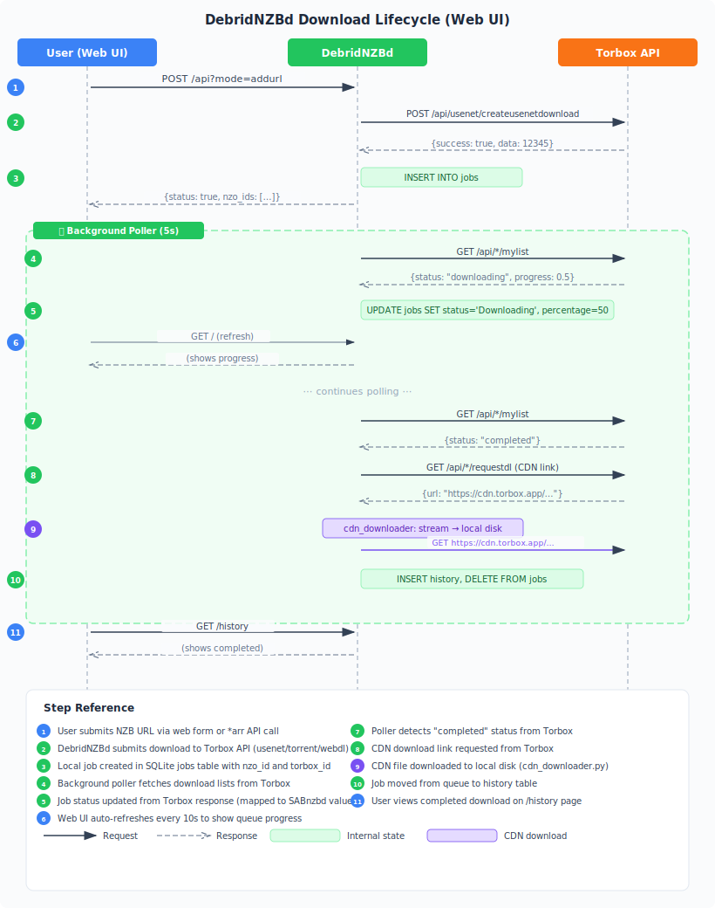
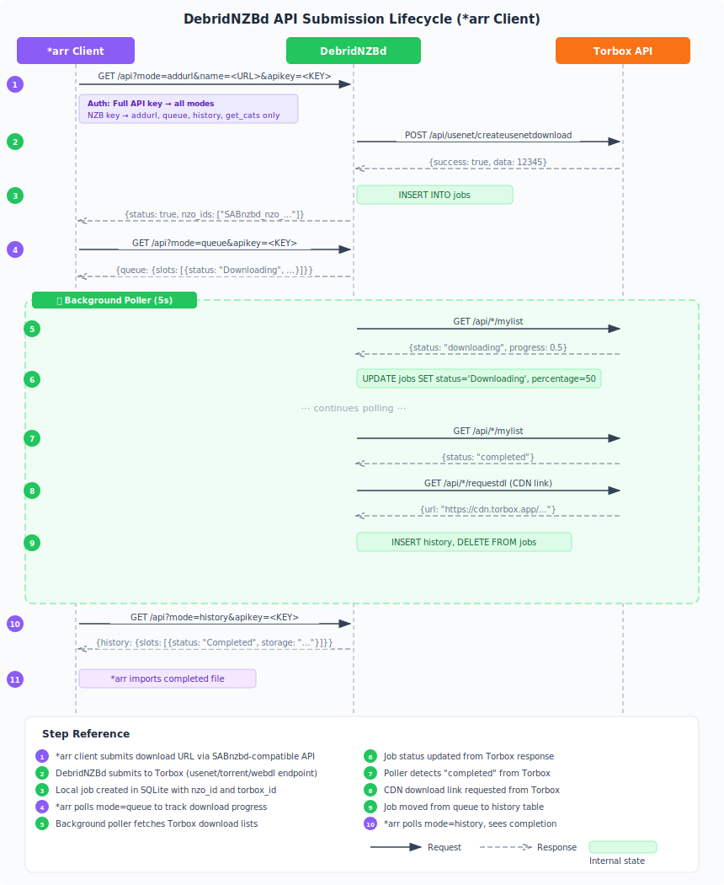
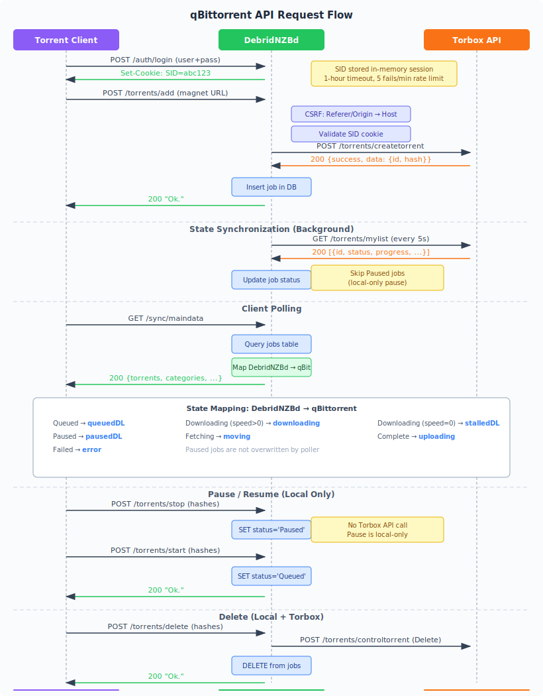

# Download Workflow

This document traces the complete lifecycle of a download in DebridNZBd, covering
the web UI submission flow, the API-based flow used by *arr clients, the file
upload flow, and the qBittorrent API flow.

## Overview — Web UI Submission



## Overview — API Submission (*arr Client)



## Overview — qBittorrent API Submission



All three flows share the same backend — the only difference is the entry point
and how progress is monitored. The core pipeline (Torbox submission, local job
creation, background polling, status mapping, CDN link retrieval, and history
archival) is identical.

## Entry Points

### Web UI Submission

The "Add NZB" form on the home page (`/`) sends a POST request to
`/api?mode=addurl` with these fields:

| Field       | Source                  | Example                                  |
|-------------|-------------------------|------------------------------------------|
| `apikey`    | Hidden field (template) | `apikey_5821170d...`                      |
| `mode`      | Hidden field            | `addurl`                                 |
| `name`      | URL input               | `https://nzbindex.com/download/...nzb`   |
| `cat`       | Category dropdown       | `tv`                                     |
| `priority`  | Priority dropdown        | `0`                                      |
| `nzbname`   | Optional name input     | `My.Show.S01E01`                          |

The JavaScript handler in `index.html` intercepts the form submit, sends it
via `fetch()` as AJAX, and on success reloads the page to show the new queue
entry. On error, it displays the error message inline.

Progress is shown through the web UI, which auto-refreshes the queue table
every 5 seconds via HTMX. The `#queue-refresh` div uses `hx-get="/queue/partial"`
and `hx-trigger="every 5s"` to poll a lightweight partial endpoint that returns
only the queue content (summary cards, queue table, completed section) without
the full page layout.

### File Upload (Web UI and API)

The web UI provides a tab to switch between URL input and file upload. The
file upload tab accepts `.torrent` and `.nzb` files.

**Web UI upload:**

The JavaScript handler sends a `FormData` object with the file to
`/api?mode=addfile&apikey=<KEY>`. The file type is detected from the
extension: `.torrent` → torrent, `.nzb` → usenet.

**API upload:**

```
POST /api?mode=addfile&apikey=<KEY>
Content-Type: multipart/form-data

nzbfile=@/path/to/file.torrent
```

The `addfile` handler in `api/queue.py` receives the uploaded file via
`UploadFile`, detects the type from the filename extension, and forwards the
raw bytes to the appropriate Torbox endpoint (`create_torrent` for `.torrent`
files, `create_usenet_download` for `.nzb` files).

File type detection uses the `detect_file_type(filename, default_type)` helper
in `api/queue.py`:

| Extension | Type      | Torbox Method                    |
|-----------|-----------|----------------------------------|
| `.torrent` | `torrent` | `client.create_torrent(file_data=bytes)` |
| `.nzb`    | `usenet`  | `client.create_usenet_download(file_data=bytes)` |
| Other     | `default_type` | Depends on `torbox.default_type` config |

### API Submission (*arr Client)

*arr clients (Sonarr, Radarr, etc.) connect to DebridNZBd using the SABnzbd
HTTP API protocol. They send requests directly to `/api?mode=...` without any
browser interaction.

**Submitting a download:**

```
GET /api?mode=addurl&name=https://nzbindex.com/download/...nzb&apikey=<KEY>&cat=tv
```

Or as a POST with form-encoded body:

```
POST /api?mode=addurl
Content-Type: application/x-www-form-urlencoded

apikey=<KEY>&name=https://nzbindex.com/download/...nzb&cat=tv&priority=0
```

**All parameters** accepted by the `addurl` mode:

| Parameter  | Required | Description                                      |
|------------|----------|--------------------------------------------------|
| `apikey`   | Yes      | Full API key or NZB key (see Auth below)        |
| `name`     | Yes      | NZB URL, magnet link, or web download URL       |
| `cat`      | No       | Category (defaults to `*`)                       |
| `priority` | No       | `-100` (paused), `0` (normal), `1` (low), `2` (high) |
| `nzbname`  | No       | Custom display name for the job                  |
| `pp`       | No       | Post-processing: `-1` default, `0` none, `1` repair, `2` unpack, `3` unpack+delete |
| `password` | No       | NZB password                                     |
| `script`   | No       | Post-processing script name                      |

### qBittorrent API Submission

Third-party torrent management clients (Transdroid, qBittorrent Remote, etc.)
connect using the qBittorrent WebUI API protocol at `/api/v2/`.

**Authentication (required first):**

```
POST /api/v2/auth/login
Content-Type: application/x-www-form-urlencoded

username=admin&password=adminpass
```

Response: `Ok.` with `Set-Cookie: SID=<40-hex>` on success, `Fails.` with 403 on failure.

**Adding a magnet link:**

```
POST /api/v2/torrents/add
Cookie: SID=<session-id>
Content-Type: application/x-www-form-urlencoded

urls=magnet%3A%3Fxt%3Durn%3Abtih%3Aabc123&category=tv
```

**Adding a .torrent file:**

```
POST /api/v2/torrents/add
Cookie: SID=<session-id>
Content-Type: multipart/form-data

torrents=@/path/to/file.torrent
```

**Pausing/resuming:**

```
POST /api/v2/torrents/stop
Cookie: SID=<session-id>

hashes=abc123

POST /api/v2/torrents/start
Cookie: SID=<session-id>

hashes=abc123
```

Note: Pause is local-only — Torbox doesn't support pausing individual torrents.
Paused jobs are protected from state-sync overwrites.

**Monitoring progress:**

```
GET /api/v2/sync/maindata?rid=0
Cookie: SID=<session-id>
```

Returns a full snapshot of all torrents, categories, tags, and server state.
Clients should store the `rid` value and pass it in subsequent requests.

**All parameters** accepted by `torrents/add`:

| Parameter  | Required | Description                                      |
|------------|----------|--------------------------------------------------|
| `urls`     | Yes*     | Magnet links or HTTP URLs, newline-separated    |
| `torrents` | Yes*     | Uploaded .torrent files (multipart)              |
| `savepath` | No       | Download directory (applied to config `folders.complete_dir`) |
| `category` | No       | Category name                                    |
| `tags`     | No       | Comma-separated tags                             |
| `paused`   | No       | `true` to start paused (local-only)              |

*At least one of `urls` or `torrents` must be provided.

## Authentication

### Web UI Session Authentication

The web UI uses cookie-based session authentication, separate from both SABnzbd API keys and qBittorrent SID sessions:

1. **First launch** — If no `misc.username`/`misc.password` are configured, temporary credentials are generated (`admin` + random 16-char password) and displayed in the log
2. **Login** — `POST /login` with `username` and `password`
   - Validates against `misc.username`/`misc.password` using `hmac.compare_digest()` (constant-time)
   - On success: creates a session, sets `web_session` cookie (48-hex, 192-bit random token)
   - If `setup_complete == "0"`: redirects to `/setup` instead of the requested page
   - On failure: re-renders login page with error message
   - Rate limited: 10 failed attempts per IP per 5-minute window
3. **Session validation** — All web pages (except exempt paths) require a valid `web_session` cookie
   - Sessions expire after 8 hours of inactivity
   - Cookie flags: `HttpOnly`, `SameSite=Lax`, conditional `Secure` (when HTTPS enabled)
4. **Trusted network bypass** — Requests from IPs in configured CIDR ranges (`misc.trusted_networks`) bypass auth
   - Disabled when temporary credentials are active
5. **Exempt paths** — `/api` (SABnzbd auth), `/api/v2/*` (qBittorrent auth), `/static/*`, `/login`, `/logout`

### Setup Wizard Flow

When a user logs in with temporary credentials:

1. After successful login, the middleware checks `misc.setup_complete`
2. If `"0"`, the user is redirected to `/setup` (GET requests) or receives 403 (non-GET)
3. `/setup` page shows a warning about temporary credentials
4. User must set a permanent username (≥3 chars) and password (≥6 chars)
5. Optionally, user can configure trusted networks (comma-separated CIDR ranges)
6. On submission: `config.set_web_credentials()` stores the new credentials, clears `temp_credentials`, sets `setup_complete = "1"`
7. Old session (temp creds) is destroyed; new session created with permanent credentials
8. User is redirected to `/?saved=1`

After setup completion, the setup banner in `base.html` disappears and normal access is restored.

### SABnzbd API Authentication

`auth_middleware` (`api/auth.py`) intercepts every `/api` request:

- Public modes (`version`, `auth`) skip auth entirely.
- For all other modes, the `apikey` parameter is validated:
  - Checks query params first (`?apikey=...`)
  - Falls back to POST form body for web UI submissions
  - Also accepts `ma_username` + `ma_password` (SABnzbd compatibility)
  - Constant-time comparison via `hmac.compare_digest()`
- Full API key → all modes; NZB key → restricted set (`addurl`, `addfile`,
  `queue`, `history`, `get_cats`)
- Invalid/missing key → 403 response

### qBittorrent API Authentication

The qBittorrent API at `/api/v2/` uses a separate cookie-based authentication system:

1. **Login**: `POST /api/v2/auth/login` validates against `misc.username`/`misc.password`
2. **Session**: A `SID` cookie (40-hex character session ID) is set on login
3. **Validation**: All endpoints except login require a valid SID cookie via `require_sid`
4. **CSRF**: Non-GET requests require `Referer` or `Origin` header matching `Host`
5. **Timeout**: Sessions expire after 1 hour of inactivity
6. **Rate limit**: Max 5 login failures per minute per IP

The `/api/v2/` prefix naturally bypasses the SABnzbd auth middleware (which only
intercepts exact `/api`), so the two auth systems operate independently.

## Shared Download Pipeline

After the request passes authentication, the following pipeline is the same
regardless of whether the request came from the web UI, an *arr client, or
the qBittorrent API.

### URL Type Detection

`detect_url_type()` in `queue.py` classifies the URL:

| Pattern                       | Type      | Torbox endpoint              |
|-------------------------------|-----------|-------------------------------|
| `magnet:?xt=urn:btih:...`    | `torrent` | `/api/torrents/createtorrent` |
| `...nzb` or `/nzb/` in path  | `usenet`  | `/api/usenet/createusenetdownload` |
| Everything else               | `usenet`*  | `/api/usenet/createusenetdownload` |

\* The default type is configurable via `torbox.default_type` in config.

`detect_file_type()` in `queue.py` classifies uploaded files:

| Extension | Type      | Torbox endpoint              |
|-----------|-----------|-------------------------------|
| `.torrent` | `torrent` | `/api/torrents/createtorrent` |
| `.nzb`    | `usenet`  | `/api/usenet/createusenetdownload` |
| Other     | `default_type` | Depends on `torbox.default_type` config |

`_derive_filename()` generates the display name from the URL, uploaded filename,
or the optional `nzbname` parameter.

### Submission to Torbox

**URL-based downloads** (`handle_addurl`):

- **Usenet:** `client.create_usenet_download(link=url, post_processing=pp)`
- **Torrent:** `client.create_torrent(magnet=url)`
- **Web DL:** `client.create_web_download(link=url)`

**File-based downloads** (`handle_addfile`):

- **Usenet:** `client.create_usenet_download(file_data=bytes, filename=name)`
- **Torrent:** `client.create_torrent(file_data=bytes, filename=name)`

Each method validates the input (URL scheme, magnet format, file size ≤ 50 MB),
sends the request with retries and SSRF protection, and returns a
`TorboxResponse` with `success`, `detail`, and `data` fields.

**Error responses:**

| Condition                     | HTTP Status | Message                              |
|-------------------------------|-------------|--------------------------------------|
| No URL provided               | 400         | `No URL provided`                    |
| No Torbox API key configured  | 500         | `Torbox API key not configured...`   |
| Torbox auth failure           | 502         | `Torbox authentication failed...`    |
| Torbox connection error       | 502         | `Cannot connect to Torbox API`       |
| Torbox rate limit             | 429         | `Torbox rate limit exceeded...`      |
| Torbox rejects the download   | 502         | `Torbox error: <detail>`             |

### Local Job Creation

On success, a row is inserted into the `jobs` table:

```
nzo_id      = SABnzbd_nzo_<10 hex chars>  (locally generated)
filename    = derived from URL, filename, or nzbname
status      = 'Queued'  (or 'Paused' if paused=true via qBittorrent API)
torbox_id   = <id from Torbox response>
torbox_type = 'usenet' | 'torrent' | 'webdl'
torbox_hash = <info hash for torrents, empty for others>
size        = 0  (unknown until Torbox reports)
percentage  = 0
time_added  = <current Unix timestamp>
tags        = ''  (populated by qBittorrent API addTags)
```

If the database insert fails, the request still returns success because
the Torbox download was already created. The state-sync poller will
reconcile on the next cycle.

The response to the client is:
- SABnzbd API: `{"status": true, "nzo_ids": ["SABnzbd_nzo_abc1234567"]}`
- qBittorrent API: `Ok.`

### Background State-Sync Poller

`run_state_sync()` in `state_sync.py` runs as an asyncio background task,
polling Torbox every `poll_interval` seconds (default 5).

Each cycle:

1. **Fetches local jobs** with `torbox_id` from the `jobs` table.
2. **Fetches three Torbox lists** in parallel:
   - `GET /api/usenet/mylist?bypass_cache=true`
   - `GET /api/torrents/mylist?bypass_cache=true`
   - `GET /api/webdl/mylist?bypass_cache=true`
3. **For each matching download**, calls `_update_job_from_torbox()`.
4. **Skips locally-paused jobs** — jobs with `Paused` status are not overwritten
   by the poller. This prevents a locally-paused job from being un-paused when
   Torbox reports it as downloading.

### Status Mapping

Torbox status strings are mapped to local SABnzbd-compatible values:

| Torbox Status         | Local Status      | Action                              |
|-----------------------|-------------------|--------------------------------------|
| `queued`              | `Queued`          | Update percentage, size              |
| `queued_caching`      | `Queued`          | Update percentage, size              |
| `downloading`         | `Downloading`     | Update percentage, size              |
| `meta_downloading`    | `Downloading`     | Update percentage, size              |
| `paused`              | `Paused`          | No percentage change                 |
| `paused_caching`      | `Paused`           | No percentage change                 |
| `seeding`             | `Downloading`     | Update percentage, size              |
| `completed`           | `Complete`        | Request CDN link, move to history    |
| `cached`              | `Complete`         | Request CDN link, move to history    |
| `error`               | `Failed`          | Move to history with fail message    |
| `failed`              | `Failed`           | Move to history with fail message    |
| Unknown               | `Queued`           | No change (safe fallback)            |

Jobs in `Complete`, `Failed`, `Fetching`, or `Paused` status are skipped
by the poller (they've already been handled or are locally managed).

### Completion: CDN Link and History

When a download reaches `completed` or `cached` status:

1. **Request CDN link** from Torbox:
   - Usenet: `GET /api/usenet/requestdl?usenet_id=<id>`
   - Torrent: `GET /api/torrents/requestdl?torrent_id=<id>`
   - Web DL: `GET /api/webdl/requestdl?web_id=<id>`
2. **If CDN request fails:** The job is **not** marked as failed. The poller
   retries on the next cycle.
3. **If CDN request succeeds:** Set job status to `Fetching`.
4. **CDN file download** (`cdn_downloader.py`): The `run_cdn_processor`
   background task picks up jobs with `Fetching` status and streams the CDN
   file to local disk using async httpx with a concurrency semaphore
   (default 2 simultaneous downloads). Files are written to a temp path
   (`.tmp_*.part`) and atomically renamed on completion. If `aiofiles` is
   not available, falls back to synchronous I/O.
5. **Move to category directory** (if configured): Downloaded files are moved
   from the incomplete directory to a category-specific subdirectory.
6. **Insert into history immediately:** The completed job is inserted into the
   `history` table right away so *arr clients can find the download path via
   `?mode=history`. The job remains in the `jobs` table during the grace period
   (see Queue Complete Grace Period below). The `nzo_url` column preserves the
   original submission URL so that retries can re-submit it.

### Queue Complete Grace Period

Completed and failed jobs stay in the `jobs` table for a configurable grace
period (`switches.queue_complete`, default 300 seconds). During this time, the
job is visible in both the queue (`?mode=queue`) and history (`?mode=history`).
After the grace period expires, `_move_to_history()` removes the job from the
`jobs` table and updates the existing history entry with any final data.

### Failure Handling

When a download reaches `error` or `failed` status:

1. Update the job row: `status='Failed'`, `fail_message='Torbox: <status>'`,
   `time_completed=<now>`.
2. Insert into history immediately (same as completion, but with `status='Failed'`),
   so *arr clients can see the failure in history right away.
3. The job stays in the `jobs` table during the grace period, then is removed
   by `_move_to_history()`.

## Progress Monitoring

### Web UI

The home page (`/`) auto-refreshes the queue every 5 seconds using HTMX.
The `#queue-refresh` div has `hx-get="/queue/partial"` and `hx-trigger="every 5s"`
attributes, which poll a lightweight partial endpoint (`/queue/partial`) that
returns only the queue content without the full page layout. The "Show Completed"
toggle sends a `queueRefresh` custom event via `htmx.trigger()` and includes
the checkbox state via `hx-include`, so the completed section visibility is
preserved across refreshes without a full page reload.

The queue table shows each job with columns: File, Status, Torbox, Category,
Priority, Progress, Size, Speed, Time Left, and action buttons (Pause/Resume,
Delete).

Action buttons (Delete, Pause, Resume) use `apiAction()` JavaScript calls
that submit POST requests to the API and show toast notifications for
success/failure, rather than navigating to a JSON response page.

Completed and failed downloads appear on the `/history` page. Each entry
shows the filename, status, category, size, download time, completion time,
and the CDN link (or error message for failures).

Failed downloads can be retried via the Retry button, which removes the
history entry and re-submits the original URL to Torbox via `?mode=retry`.

### *arr Client API Responses

*arr clients monitor progress through two API modes:

**`?mode=queue`** — Returns active downloads:

```json
{
  "status": true,
  "queue": {
    "paused": false,
    "noofslots": 1,
    "timeleft": "0:02:00",
    "speed": "2.5 MB/s",
    "kbpersec": "2560",
    "size": "1.0 GB",
    "sizeleft": "500 MB",
    "mb": 1024.0,
    "mbleft": 500.0,
    "slots": [
      {
        "status": "Downloading",
        "index": 0,
        "filename": "Some.Show.S01E01",
        "nzo_id": "SABnzbd_nzo_abc123",
        "cat": "tv",
        "percentage": "50",
        "size": "1.0 GB",
        "sizeleft": "500 MB",
        "timeleft": "0:02:00",
        "priority": 0
      }
    ]
  }
}
```

**`?mode=history`** — Returns completed/failed downloads:

```json
{
  "status": true,
  "history": {
    "noofslots": 1,
    "last_history_update": 1700000000.0,
    "slots": [
      {
        "status": "Completed",
        "nzo_id": "SABnzbd_nzo_abc123",
        "name": "Some.Show.S01E01",
        "nzb_name": "Some.Show.S01E01",
        "category": "tv",
        "size": "1.0 GB",
        "storage": "/path/to/file",
        "download_time": 120,
        "completed": 1700000000,
        "fail_message": ""
      }
    ]
  }
}
```

The `storage` field contains the CDN link (or local file path) that *arr uses
to import the completed download.

### qBittorrent API Responses

qBittorrent clients monitor progress through the sync endpoint:

**`GET /api/v2/sync/maindata`** — Returns full snapshot:

```json
{
  "rid": 1,
  "full_update": true,
  "torrents": {
    "abc123...": {
      "hash": "abc123...",
      "name": "Some.Show.S01E01",
      "state": "downloading",
      "size": 1073741824,
      "dlspeed": 2560000,
      "upspeed": 0,
      "progress": 0.5,
      "category": "tv",
      "tags": ""
    }
  },
  "categories": {
    "tv": {"name": "tv", "savePath": "/downloads/complete/tv"}
  },
  "tags": [],
  "server_state": {
    "dl_info_speed": 2560000,
    "up_info_speed": 0,
    "connection_status": "connected"
  }
}
```

**State mapping** (DebridNZBd → qBittorrent):

| DebridNZBd Status | qBittorrent State |
|---|---|
| Queued | `queuedDL` |
| Downloading (speed > 0) | `downloading` |
| Downloading (speed = 0) | `stalledDL` |
| Paused | `pausedDL` |
| Fetching | `moving` |
| Complete | `uploading` |
| Failed | `error` |

## Orphaned Jobs

If a download is deleted on the Torbox side (e.g., by the user in the
Torbox web UI), the state-sync poller attempts to reconcile orphaned local
jobs using `_reconcile_orphaned_jobs()`. This second-pass matching process
uses the following fallback strategies:

1. **URL substring match** — If the original submission URL appears in a
   Torbox download's name or URL, the job is re-linked.
2. **Magnet hash match** — For torrent-type jobs, if the `torbox_hash`
   matches a Torbox download's hash, the job is re-linked.
3. **Filename match** — If the local job's filename matches a Torbox
   download's name, the job is re-linked.
4. **Type-based fallback** — For any remaining orphaned jobs, the most
   recent unclaimed Torbox download of the same type is assigned.

If no match is found after all fallbacks, the orphaned job remains in its
current status. This can result in jobs stuck in `Queued` or `Downloading`
status if the Torbox download was permanently removed.

## Configuration

Key configuration values that affect the download workflow:

| Section   | Key                    | Default                       | Purpose                                         |
|-----------|------------------------|-------------------------------|-------------------------------------------------|
| `torbox`  | `api_key`              | *(empty, required)*           | Torbox API authentication key                   |
| `torbox`  | `base_url`             | `https://api.torbox.app/v1`  | Torbox API base URL                              |
| `torbox`  | `default_type`         | `usenet`                      | Default type for unrecognized URLs               |
| `torbox`  | `poll_interval`        | `5`                           | Seconds between state-sync polls                 |
| `torbox`  | `download_on_complete` | `1` (true)                    | Whether to request CDN links on completion      |
| `torbox`  | `qbit_show_all_types`  | `0`                           | Show usenet/webdl in qBittorrent API             |
| `torbox`  | `qbit_dl_limit`        | `0`                           | Download speed limit for qBittorrent API (B/s)    |
| `misc`    | `api_key`              | *(auto-generated)*            | Full API key for admin access                    |
| `misc`    | `nzb_key`              | *(auto-generated)*            | Restricted NZB key for addurl/queue/history     |
| `misc`    | `username`             | `admin` (auto-set on first launch) | Username for qBittorrent/WebUI login (restricted) |
| `misc`    | `password`             | *(empty, auto-set on first launch)* | Password for qBittorrent/WebUI login (restricted) |
| `misc`    | `trusted_networks`     | *(empty)*                      | CIDR ranges that bypass web UI auth              |
| `misc`    | `temp_credentials`     | `0`                            | Flag: 1 = using temporary credentials           |
| `misc`    | `setup_complete`       | `0`                            | Flag: 1 = setup wizard completed                 |